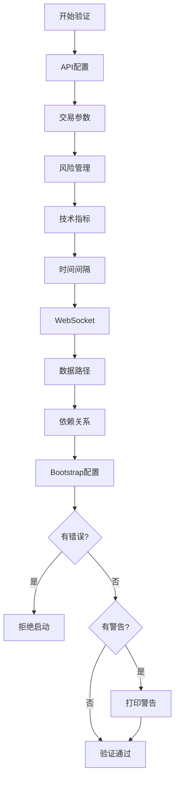

## ConfigValidator - 配置验证系统

## 📋 概述

**ConfigValidator** 是一个全面的配置验证系统，在系统启动前检查所有配置项的有效性。

### 🎯 核心功能

1. **API配置验证**：Binance API密钥、Discord Token等
2. **交易参数验证**：信心值、胜率、风险回报比等
3. **风险管理验证**：预算比例、杠杆、止损距离等
4. **技术指标验证**：EMA、RSI、ATR、ADX等参数
5. **时间间隔验证**：扫描间隔、监控间隔等
6. **WebSocket参数验证**：符号限制、分片大小等
7. **依赖关系验证**：配置项之间的逻辑关系
8. **Bootstrap配置验证**：引导期配置必须更宽松

---

## 🚨 解决的问题

### 问题1：配置错误导致运行时崩溃

❌ **没有验证**：
```python
# 配置错误（MIN_CONFIDENCE > 1）
MIN_CONFIDENCE = 1.5

# 运行时错误
if score >= config.MIN_CONFIDENCE:  # 永远不会触发
    # ...
```

✅ **有了ConfigValidator**：
```python
validator = ConfigValidator(Config)
valid, errors, warnings = validator.validate_all()

# 输出: ❌ MIN_CONFIDENCE 必须在0-1之间: 当前值=1.5, 有效范围=[0.0, 1.0]
# 系统拒绝启动
```

### 问题2：配置依赖关系错误

❌ **没有验证**：
```python
# 逻辑错误（MIN > MAX）
MIN_RR_RATIO = 5.0
MAX_RR_RATIO = 3.0

# 运行时：没有信号满足条件
```

✅ **有了ConfigValidator**：
```python
# 输出: ❌ MIN_RR_RATIO (5.0) 必须小于 MAX_RR_RATIO (3.0)
# 在启动前发现并阻止
```

### 问题3：Bootstrap配置错误

❌ **没有验证**：
```python
# 引导期阈值高于正常阈值（违反设计）
BOOTSTRAP_MIN_WIN_PROBABILITY = 0.6  # 60%
MIN_WIN_PROBABILITY = 0.45  # 45%

# 引导期反而更严格，失去作用
```

✅ **有了ConfigValidator**：
```python
# 输出: ❌ BOOTSTRAP_MIN_WIN_PROBABILITY (0.6) 必须小于等于 MIN_WIN_PROBABILITY (0.45)
# 确保引导期配置更宽松
```

---

## 🔧 基本使用

### 1️⃣ 验证现有配置

```python
from src.config import Config
from src.utils.config_validator import validate_config

# 验证配置
valid, errors, warnings = validate_config(Config)

if not valid:
    print("❌ 配置验证失败:")
    for error in errors:
        print(f"   {error}")
    exit(1)

print("✅ 配置验证通过")
```

### 2️⃣ 集成到启动流程

```python
# src/main.py
from src.config import Config
from src.utils.config_validator import validate_config

def main():
    # 🔥 第一步：验证配置
    valid, errors, warnings = validate_config(Config)
    
    if not valid:
        logger.error("❌ 配置验证失败，系统拒绝启动")
        for error in errors:
            logger.error(f"   {error}")
        return
    
    # 打印警告
    for warning in warnings:
        logger.warning(warning)
    
    logger.info("✅ 配置验证通过，开始启动系统...")
    
    # 继续启动...
```

### 3️⃣ 获取详细报告

```python
from src.utils.config_validator import ConfigValidator

validator = ConfigValidator(Config)
validator.validate_all()

# 获取报告
report = validator.get_validation_report()

print(f"验证状态: {report['valid']}")
print(f"总错误数: {report['total_errors']}")
print(f"总警告数: {report['total_warnings']}")
print(f"配置摘要: {report['config_summary']}")
```

---

## 📋 验证清单

### ✅ API配置

| 配置项 | 验证规则 | 级别 |
|--------|---------|------|
| BINANCE_API_KEY | 不能为空 | ERROR |
| BINANCE_API_SECRET | 不能为空 | ERROR |
| DISCORD_TOKEN | 可选（警告） | WARNING |

### ✅ 交易参数

| 配置项 | 有效范围 | 级别 |
|--------|---------|------|
| MIN_CONFIDENCE | 0.0 - 1.0 | ERROR |
| MIN_WIN_PROBABILITY | 0.0 - 1.0 | ERROR |
| MIN_RR_RATIO | 0.0 - 10.0 | ERROR |
| MAX_RR_RATIO | 0.0 - 20.0 | ERROR |
| MAX_CONCURRENT_ORDERS | 1 - 50 | ERROR |
| CYCLE_INTERVAL | 10 - 3600秒 | ERROR |

### ✅ 风险管理

| 配置项 | 有效范围 | 级别 |
|--------|---------|------|
| MAX_TOTAL_BUDGET_RATIO | 0.0 - 1.0 | ERROR |
| MAX_SINGLE_POSITION_RATIO | 0.0 - 1.0 | ERROR |
| MAX_TOTAL_MARGIN_RATIO | 0.0 - 1.0 | ERROR |
| EQUITY_USAGE_RATIO | 0.0 - 1.0 | ERROR |
| MIN_NOTIONAL_VALUE | 1.0 - 1000.0 USDT | ERROR |
| MIN_STOP_DISTANCE_PCT | 0.0001 - 0.1 | ERROR |
| RISK_KILL_THRESHOLD | 0.0 - 1.0 | ERROR |
| MIN_LEVERAGE | 0.1 - 10.0 | ERROR |

### ✅ 技术指标

| 配置项 | 验证规则 | 级别 |
|--------|---------|------|
| EMA_FAST < EMA_SLOW | 必须满足 | ERROR |
| RSI_PERIOD | 2 - 100 | ERROR |
| RSI_OVERBOUGHT > RSI_OVERSOLD | 必须满足 | ERROR |
| ATR_PERIOD | 5 - 50 | ERROR |
| ATR_MULTIPLIER | 0.5 - 10.0 | ERROR |
| ADX_PERIOD | 5 - 50 | ERROR |
| ADX阈值递增 | HARD < WEAK < TREND | WARNING |

### ✅ 时间间隔

| 配置项 | 有效范围 | 级别 |
|--------|---------|------|
| SCAN_INTERVAL | 10 - 3600秒 | ERROR |
| POSITION_MONITOR_INTERVAL | 10 - 600秒 | ERROR |
| VIRTUAL_POSITION_CYCLE_INTERVAL | 5 - 300秒 | ERROR |

### ✅ WebSocket参数

| 配置项 | 有效范围 | 级别 |
|--------|---------|------|
| WEBSOCKET_SYMBOL_LIMIT | 10 - 1000 | ERROR |
| WEBSOCKET_SHARD_SIZE | 10 - 200 | ERROR |
| WEBSOCKET_HEARTBEAT_TIMEOUT | 5 - 300秒 | ERROR |
| SHARD_SIZE < SYMBOL_LIMIT | 必须满足 | WARNING |

### ✅ 依赖关系

| 依赖关系 | 验证规则 | 级别 |
|---------|---------|------|
| MIN_RR_RATIO < MAX_RR_RATIO | 必须满足 | ERROR |
| SINGLE_POSITION ≤ TOTAL_BUDGET | 必须满足 | WARNING |
| CROSS_MARGIN_THRESHOLD < MAX_MARGIN | 必须满足 | WARNING |

### ✅ Bootstrap配置

| 依赖关系 | 验证规则 | 级别 |
|---------|---------|------|
| BOOTSTRAP_MIN_WIN_PROBABILITY ≤ MIN_WIN_PROBABILITY | 必须满足 | ERROR |
| BOOTSTRAP_MIN_CONFIDENCE ≤ MIN_CONFIDENCE | 必须满足 | ERROR |
| BOOTSTRAP_SIGNAL_QUALITY ≤ SIGNAL_QUALITY | 必须满足 | ERROR |
| BOOTSTRAP_TRADE_LIMIT | 10 - 500 | ERROR |

---

## 🎯 验证流程



---

## 📊 示例输出

### ✅ 验证通过

```
================================================================================
✅ 配置验证通过：所有配置项有效
================================================================================
```

### ❌ 验证失败

```
================================================================================
❌ 配置验证失败：发现以下错误
================================================================================
   ❌ 缺少 BINANCE_API_KEY 环境变量
   ❌ MIN_CONFIDENCE 必须在0-1之间: 当前值=1.5, 有效范围=[0.0, 1.0]
   ❌ MIN_RR_RATIO (5.0) 必须小于 MAX_RR_RATIO (3.0)
   ❌ EMA_FAST (50) 必须小于 EMA_SLOW (20)
   ❌ BOOTSTRAP_MIN_WIN_PROBABILITY (0.6) 必须小于等于 MIN_WIN_PROBABILITY (0.45)
================================================================================
```

### ⚠️  有警告

```
================================================================================
⚠️  配置验证警告：发现以下警告
================================================================================
   ⚠️  未设置 DISCORD_TOKEN - Discord通知将被禁用
   ⚠️  WEBSOCKET_SHARD_SIZE (500) 大于 WEBSOCKET_SYMBOL_LIMIT (200)
   ⚠️  ADX阈值应该递增: HARD_REJECT (15.0) < WEAK_TREND (10.0) < TREND (20.0)
================================================================================
```

---

## 🔧 自定义验证

### 添加自定义验证规则

```python
class CustomConfigValidator(ConfigValidator):
    def _validate_custom_rules(self):
        """添加自定义验证规则"""
        # 示例：验证交易时间窗口
        if hasattr(self.config, 'TRADING_START_HOUR') and \
           hasattr(self.config, 'TRADING_END_HOUR'):
            if self.config.TRADING_START_HOUR >= self.config.TRADING_END_HOUR:
                self.errors.append(
                    f"❌ TRADING_START_HOUR ({self.config.TRADING_START_HOUR}) "
                    f"必须小于 TRADING_END_HOUR ({self.config.TRADING_END_HOUR})"
                )
    
    def validate_all(self):
        """重写验证方法，添加自定义规则"""
        # 调用父类验证
        super().validate_all()
        
        # 添加自定义验证
        self._validate_custom_rules()
        
        return len(self.errors) == 0, self.errors, self.warnings
```

---

## 🐛 故障排除

### 问题1：验证失败但配置看起来正确

**原因**：环境变量未设置或类型转换错误

**解决方案**：
```bash
# 检查环境变量
echo $BINANCE_API_KEY
echo $MIN_CONFIDENCE

# 确保类型正确
export MIN_CONFIDENCE="0.40"  # ✅ 字符串会被转换为float
export MIN_CONFIDENCE=0.40    # ✅ 也可以
```

### 问题2：Bootstrap配置验证失败

**原因**：Bootstrap阈值高于正常阈值

**解决方案**：
```python
# ❌ 错误：引导期阈值过高
BOOTSTRAP_MIN_WIN_PROBABILITY = 0.6  # 60%
MIN_WIN_PROBABILITY = 0.45  # 45%

# ✅ 正确：引导期阈值更低（更宽松）
BOOTSTRAP_MIN_WIN_PROBABILITY = 0.2  # 20%
MIN_WIN_PROBABILITY = 0.45  # 45%
```

### 问题3：依赖关系验证失败

**原因**：配置项逻辑不一致

**解决方案**：
```python
# ❌ 错误：MIN > MAX
MIN_RR_RATIO = 5.0
MAX_RR_RATIO = 3.0

# ✅ 正确：MIN < MAX
MIN_RR_RATIO = 0.8
MAX_RR_RATIO = 5.0
```

---

## 🎯 最佳实践

### 1️⃣ 总是在启动时验证

```python
def main():
    # 🔥 第一步：验证配置
    valid, errors, warnings = validate_config(Config)
    
    if not valid:
        logger.error("配置无效，拒绝启动")
        sys.exit(1)
    
    # 继续启动...
```

### 2️⃣ 记录验证结果

```python
validator = ConfigValidator(Config)
valid, errors, warnings = validator.validate_all()

# 保存验证报告
import json
report = validator.get_validation_report()
with open("data/config_validation_report.json", "w") as f:
    json.dump(report, f, indent=2)
```

### 3️⃣ 监控配置变更

```python
# 定期验证配置（检测运行时修改）
import schedule

def validate_config_periodic():
    valid, errors, warnings = validate_config(Config)
    if not valid:
        logger.error("配置验证失败，系统可能不稳定")
        # 触发告警

schedule.every(1).hour.do(validate_config_periodic)
```

### 4️⃣ 单元测试配置

```python
import pytest
from src.config import Config
from src.utils.config_validator import validate_config

def test_config_validation():
    """测试配置验证"""
    valid, errors, warnings = validate_config(Config)
    
    assert valid, f"配置验证失败: {errors}"
    assert len(errors) == 0
```

---

## 🔗 相关文档

- [SafetyValidator - 运行时安全验证](./SAFETY_VALIDATOR.md)
- [ExceptionHandler - 异常处理规范](./EXCEPTION_HANDLER.md)
- [SmartLogger - 智能日志系统](./SMART_LOGGER.md)

---

**版本**：v3.26+  
**状态**：✅ 生产就绪  
**维护者**：SelfLearningTrader Team
